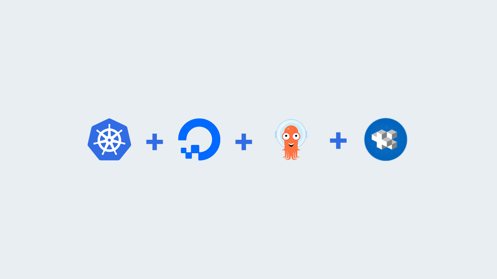

# ArgoCD Gitops With Jsonnet on DigitalOcean Kubernetes

## 💙 What is this?

This is an example of how to use [ArgoCD](https://argoproj.github.io/argo-cd/) with [Jsonnet](https://jsonnet.org/) on [DigitalOcean Kubernetes](https://try.digitalocean.com/kubernetes-in-minutes). The purpose of this repository is educational and entirely inspired by [DigitalOcean Abhi's K8S Bootstrapper](https://github.com/hivenetes/k8s-bootstrapper). Jsonnet gives a different perspective on how one can manage their Kubernetes manifests and if done right - it can be a very powerful tool.

For a more detailed explanation of the infrastructure configuration, see [this repository](https://github.com/hivenetes/k8s-bootstrapper).

## ❓ What is in here?

The repository contains Jsonnet templates for the following:
- Deployment
- Ingress
- Service
- App-of-Apps

The repository also have these in a non-templated variant.